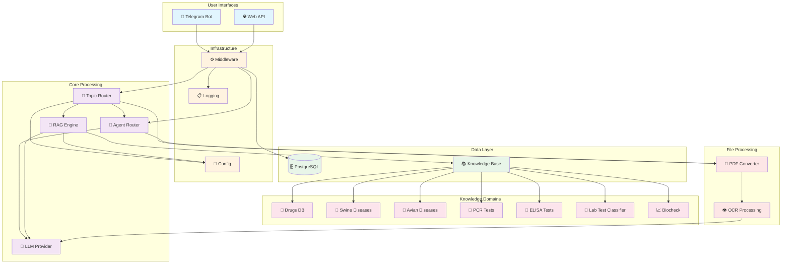

# Vet-RAG-System - Система RAG для ветеринарии

## 📋 Описание проекта

Vet-RAG-System - это интеллектуальная система на основе RAG (Retrieval-Augmented Generation) для ветеринарной медицины. Система предоставляет доступ к знаниям через Telegram-бота и REST API, обрабатывая запросы пользователей с использованием векторной базы знаний и языковых моделей.

## 🏗️ Архитектурная диаграмма системы



## 🚀 Архитектура компонентов

### 1. **Telegram Bot** (`telegram_bot/`)
- **Назначение**: Основной интерфейс для пользователей
- **Функции**:
  - Обработка команд пользователей
  - Управление диалогами
  - Интеграция с RAG-системой
  - Middleware для работы с БД

### 2. **Web API** (`web_api/`)
- **Назначение**: REST API для интеграции с внешними системами
- **Функции**:
  - Обработка HTTP-запросов
  - Загрузка файлов
  - Маршрутизация по темам
  - Управление историей диалогов

Для подробной информации об API см. [web_api/README.md](app/web_api/README.md)

### 3. **RAG Engine** (`rag/`)
- **Назначение**: Ядро системы обработки знаний
- **Функции**:
  - Парсинг документов (PDF, DOCX, Excel)
  - Векторное индексирование
  - Поиск релевантной информации
  - Интеграция с языковыми моделями

### 4. **Knowledge Base** (`knowledge/`)
- **Назначение**: База знаний ветеринарной медицины
- **Структура**:
  - `drugs/` - база данных препаратов
  - `swine_diseases/` - болезни свиней
  - `avian_diseases/` - болезни птиц
  - `pcr_test/` - ПЦР-тесты
  - `avian_biocheck/` - биохимические показатели птиц
  - `abbreviations.py` - расшифровка аббревиатур

### 5. **Database** (`db/`)
- **Назначение**: Управление данными
- **Функции**:
  - PostgreSQL подключения
  - Миграции (Alembic)
  - Модели пользователей и препаратов

### 6. **Topic Router** (`topics/`)
- **Назначение**: Маршрутизация запросов по темам
- **Функции**:
  - Определение темы запроса
  - Контекстное управление
  - Генерация ответов
- **Поддерживаемые темы**:
  - `avian_disease_diagnosis` - диагностика болезней птиц
  - `swine_disease_diagnosis` - диагностика болезней свиней
  - `drug_instruction` - инструкции по препаратам
  - `pcr_test_interpretation` - интерпретация ПЦР-тестов
  - `elisa_test_interpretation` - интерпретация ELISA-тестов
  - `capabilities` - возможности системы
  - `general` - общие вопросы
  - `chatter` - неформальное общение

## 🛠️ Технологический стек

- **Backend**: Python 3.8+, FastAPI, SQLAlchemy, Pydantic
- **Telegram**: aiogram 3.x
- **Database**: PostgreSQL, asyncpg
- **LLM Integration**: VseGPT API, Inline AI, OpenAI-compatible APIs
- **Document Processing**: PyMuPDF, pdfplumber, python-docx, pdf2image
- **Text Processing**: pymorphy3, scikit-learn
- **Containerization**: Docker, Docker Compose
- **Database Migrations**: Alembic
- **Monitoring**: Structured logging, rich

## 📦 Установка и запуск

### Предварительные требования
- Python 3.8+
- Docker и Docker Compose
- API ключи для LLM провайдеров (VseGPT, Inline AI или OpenAI-совместимые)
- Telegram Bot Token (получить у @BotFather)

### 1. Клонирование и настройка
Необходимо установить консольное раширение git для работы с большими файлми https://git-lfs.com/
```bash
git clone <repository-url>
cd agro-vet-ai
git lfs install
cp .env_example .env
# Настройте переменные окружения в .env
```

### 2. Запуск через Docker Compose
```bash
# Запуск всех сервисов
docker-compose up -d

# Просмотр логов
docker-compose logs -f app_rag
```

### 3. Локальная разработка
```bash
# Создание виртуального окружения
python -m venv .venv
source .venv/bin/activate  # Linux/Mac
# или
.venv\Scripts\activate     # Windows

# Установка зависимостей
pip install -r requirements.txt

# Запуск миграций БД
alembic upgrade head

# Запуск системы
python main.py              # Оба сервиса
python main.py telegram     # Только Telegram бот
python main.py api          # Только Web API
```

### Git lfs
- Добавление нового типа файлов в lfs `git lfs track "*.dump"`
- Скачивание файлов, если у вас локльно только ссылки `git lfs pull`

## 🔧 Конфигурация

### Основные переменные окружения (`.env`):
```env
# Telegram Bot
API_TOKEN=TELEGRAM_BOT_TOKEN

# Docker
COMPOSE_PROJECT_NAME=rag

# Database
POSTGRES_USER=vetbot
POSTGRES_PASSWORD=vetbot
POSTGRES_DB=vetbot
DB_HOST=postgres_rag
DB_PORT=5432

# Web API
API_SERVICE_HOST_PORT=80
API_SERVICE_CONTAINER_PORT=8000

# PgAdmin
PGADMIN_EMAIL=admin@example.com
PGADMIN_PASSWORD=adminpassword
PGADMIN_PORT=8081

# LLM Providers
VSEGPT_API_KEY=sk-YOUR_API_KEY
INLINE_API_KEY=sk-YOUR_API_KEY
VSEGPT_BASE_URL=https://api.vsegpt.ru/v1
INLINE_BASE_URL=https://api.inline.ai/v1
ORGANIZATION=YOUR_ORGANIZATION
PROJECT_ID=<project-id>
REQUEST_TIMEOUT=30

# Models
MAIN_MODEL=openai/gpt-4o-mini
TOOL_MODEL=openai/gpt-4o-mini
EVALUATION_MODEL=openai/gpt-4o-mini
OCR_MODEL=vis-google/gemma-3-27b-it
EMBEDDING_MODEL=emb-openai/text-embedding-3-small

# Mode
MODE=dev  # dev или prod
```

## 📱 Использование

### Telegram Bot
1. Найдите бота по токену
2. Отправьте команду `/start` для начала работы
3. Задавайте вопросы о ветеринарной медицине
4. Загружайте документы для анализа

## 📊 Мониторинг и логирование

- **Логи**: Сохраняются в `logs/` директории
- **PgAdmin**: Доступен на `http://localhost:8081`
- **API Health**: `http://localhost:80/api/up`

### Формат логов
Логи сохраняются в двух файлах:
- `app.log` - основные логи приложения
- `test.log` - логи тестов

Каждый день создается новая папка с датой в формате `YYYY-MM-DD`, в которой сохраняются логи за этот день.

### Уровни логирования
Система поддерживает стандартные уровни логирования:
- `DEBUG` - отладочная информация
- `INFO` - информационные сообщения
- `WARNING` - предупреждения
- `ERROR` - ошибки
- `CRITICAL` - критические ошибки


## 🛠️ Создание дополнительных логов

### Использование существующих логгеров
В проекте доступен новый логгер:

1. **get_logger** - основной логгер приложения:
   ```python
   from app.utils.logger import get_logger

   # Пример использования
   app_logger = get_logger(__name__)
   app_logger.info("Информационное сообщение")
   app_logger.error("Сообщение об ошибке")
   app_logger.debug("Отладочная информация")
   ```

### Создание новых логгеров
Для создания дополнительных логгеров используйте функцию `get_logger`:

```python
from app.utils.logger import get_logger

# Создание нового логгера
my_logger = get_logger("my_component")

# Использование логгера
my_logger.info("Сообщение от моего компонента")
my_logger.error("Ошибка в моем компоненте")
```

Новые логгеры будут автоматически использовать настройки уровня логирования из secrets и будут сохраняться в файлы в папке `logs/YYYY-MM-DD/`. В режиме `dev` логи также будут выводиться в консоль.


Вывод в консоль происходит только в режиме разработки (`mode='dev'`).

## 🧪 Тестирование

```bash
# Запуск тестов
python -m pytest tests/

# Запуск с покрытием
python -m pytest tests/ --cov=. --cov-report=html
```

## 🔄 Развертывание

### Docker Swarm
```bash
docker stack deploy -c docker-compose.swarm.yaml vet-rag
```

### Production
1. Настройте переменные окружения для production
2. Используйте reverse proxy (nginx)
3. Настройте SSL сертификаты
4. Настройте мониторинг и алерты

## 🤝 Разработка

### Структура проекта
```
agro-vet-ai/
├── main.py                 # Точка входа
├── docker-compose.yaml     # Docker конфигурация
├── requirements.txt        # Python зависимости
├── alembic.ini            # Конфигурация миграций
├── log_config.py          # Настройка логирования
├── telegram_bot/          # Telegram бот
│   ├── bot.py
│   ├── constants.py
│   └── handlers/
├── web_api/              # REST API
│   ├── api_server.py
│   ├── models.py
│   ├── runner.py
│   └── server_manager.py
├── rag/                  # RAG движок
│   ├── parsers/
│   ├── tokenizer/
│   ├── markdown_fragments/
│   └── base.py
├── knowledge/            # База знаний
│   ├── data/
│   │   ├── drugs/
│   │   ├── swine_diseases/
│   │   ├── avian_diseases/
│   │   ├── pcr_test/
│   │   └── avian_biocheck/
│   └── core/
├── db/                   # База данных
│   ├── db.py
│   ├── database_manager.py
│   └── migrations/
├── topics/               # Маршрутизация тем
│   ├── router.py
│   ├── llm_classifier.py
│   └── questions/
├── llm/                  # LLM провайдеры
│   ├── providers/
│   ├── prompts/
│   └── evaluation/
├── middlewares/          # Middleware компоненты
├── users/                # Модели пользователей
├── utils/                # Утилиты
├── scripts/              # Скрипты
├── logs/                 # Логи
└── var/                  # Переменные данные
```

### Добавление новых знаний
1. Добавьте данные в соответствующую директорию `knowledge/data/`
2. Обновите парсеры в `rag/parsers/` если необходимо
3. Переиндексируйте векторную базу
4. Обновите конфигурацию тем

## 📝 Лицензия

---

## 👥 Команда

## 6. Переменные окружение
* `MODE` — тип окружения приложения:

  * `dev` — режим разработки
      - выводит отладочную информацию с указанием категории вопросов
  * `prod` — режим эксплуатации (без лишней информации)
---

# Проверка работы
- После запуска вы можете проверить работу бота, отправив `/start` в Telegram.
- В случае ошибок убедитесь, что:
  - Контейнер с PostgreSQL работает (`docker ps`).
  - Переменные окружения (`.env`) настроены правильно.

# Работа с базой данных
Для информации о миграциях базы данных и загрузке дампов см. [db/migrations/README.md](app/db/migrations/README.md)

# Генератор Markdown-файлов для базы данных

Данный модуль предназначен для генерации Markdown-файлов на основе таблицы из базы данных.
Папка модуля: `/rag/markdown_fragments`

## Запуск скрипта

Чтобы запустить скрипт из корневой директории проекта, выполните следующие шаги:

1. Выполните пункты `1-4` из раздела `Запуск проекта локально`.

2. Перейдите в корневую директорию проекта.

3. Отредактируйте файл `/rag/markdown_fragments/main.py`, указав необходимые параметры для вызываемых методов.

5. Запутите модуль в коммандной строке:
   ```bash
   python3 -m rag.markdown_fragments.main
   ```

# Парсер каталога препаратов ВИК

Данный модуль предназначен для наполнения базы данных на основе каталога препаратов ВИК.
<br>
Папка модуля: `/rag/tokenizer`

## Запуск скрипта

Чтобы запустить скрипт из корневой директории проекта, выполните следующие шаги:

1. Выполните пункты `1-4` из раздела `Запуск проекта локально`.

2. Перейдите в корневую директорию проекта.

3. Отредактируйте файл `/rag/tokenizer/main.py`, указав путь к к PDF-файлу с каталогом препаратов и папке для сохранения инструкций относительно корневой папки проекта.

5. Запутите модуль в коммандной строке:
   ```bash
   python3 -m rag.tokenizer.main
   ```

