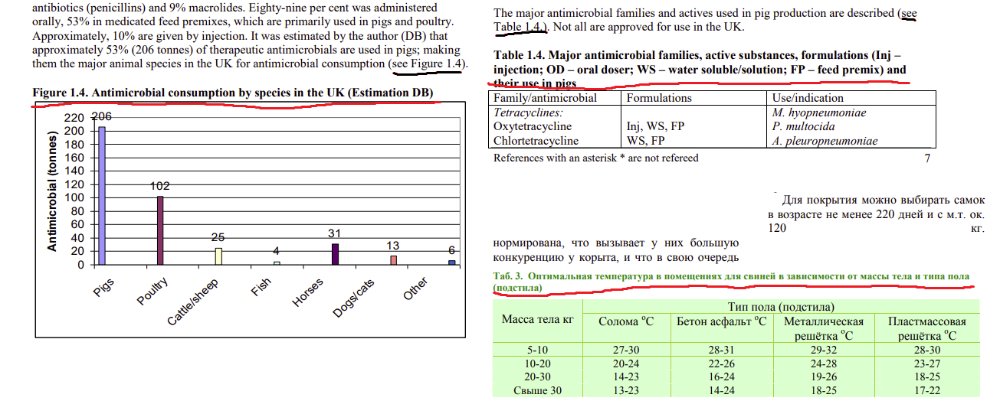
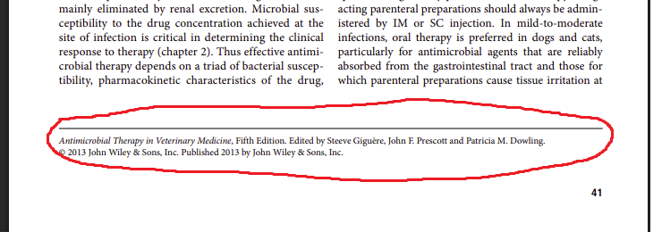
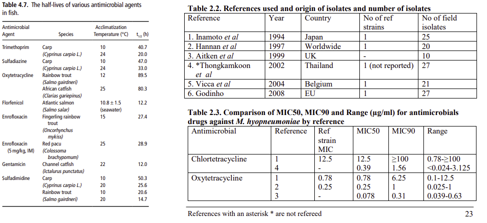
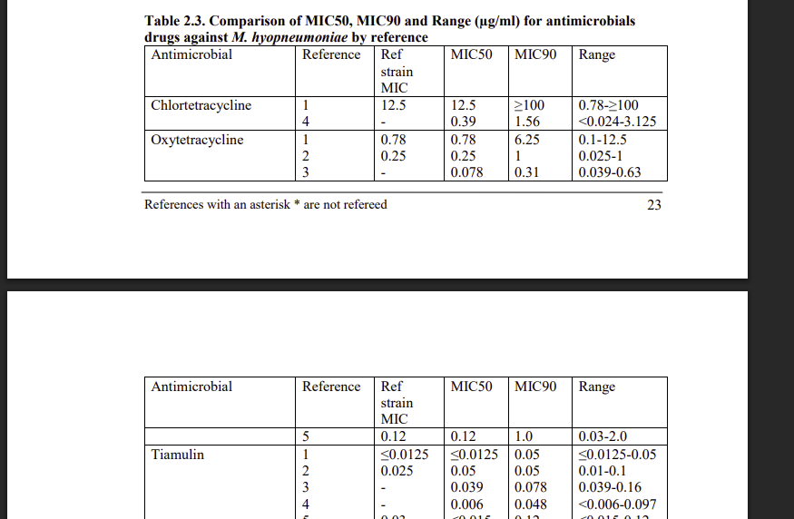
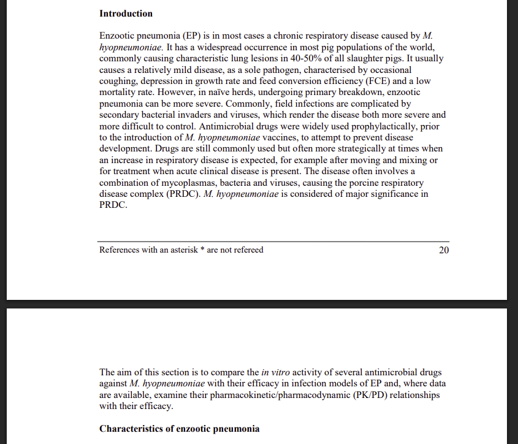

# BookSplitter
## Описание

Класс предназначенный для парсинга json страниц в формате:

```json
[
  {
    "index": 0,
    "markdown": "markdown text with headers"
  },
  {
    "index": 0,
    "markdown": "markdown text with headers"
  }
]
```
Утилита `utils/pdf-ocr-1.0` парсит pdf файлы в данном формате.

BookSplitter предоставляет функции трех типов:
- с префиксом `before_` - это функции предназначенные для изменения json страниц. Например для удаления лишних символов в тексте, таблицах и т.д и т.п.
- с префиксом `extract_` - это функции извлечения контента, например текста, описания изображений, таблиц.
- с префиксом `after_` - это функции обрабатывающие уже извлеченные данные с помощью `extract_`

Все функции в классе вызываются цепочкой вызовов, образуя pipline обработки страниц, который может быть для каждой книге уникальными.

### Подробнее про аргументы при инициализации и функции:
- аргументы `table_description_regex` и `image_description_regex` указываются для выделения описания таблицы или изображения. 
Важно написать регулярное выражение, так чтобы по нему находилось описание подчеркнутое красным, 
но не находился текст с упоминанием таблицы или изображения подчеркнутого черным. 
Пример регулярного выражения: `Figure \d{1,3} `, `Table \d{1,3}\.\d{1,3}\.`, `(Рис\. \d{1,3}|Рис\.\d{1,3})`, `(Таб\. \d{1,3}|Таблица\. \d{1,3}|Пример \d{1,3}:|Таблица \d{1,3})`

- 

- аргумент `to_drop_line_regex` для удаления лишних строк, например этот текст может быть лишним


- Функция `before_delete_newlines_symbol_at_table_cells` удаляет символ '\n' внутри ячейки таблицы. 
'\n' мешает корректному парсингу таблиц, обязательно надо проверить наличие переноса строк в markdown таблицах. 
Например, в таблице слева (4.7) из книги по антимикробной терапии, нет переносов строк в ячейк, а в таблицах справа 
(2.2, 2.3) из книги по препаратам для свиней в ячейках есть перенос строки, хотя визуально  текст переносится во всех таблицах



- `extract_image`, `extract_table`, `extract_text` основные функции извлечения из сущностей.
Изображения и таблицы сохраняются как отдельные чанки, текст сохраняется как чанки Markdown текста разбитые по заголовкам.
- `after_combine_single_text_separated_by_diff_pages` и `after_combine_single_table_separated_by_diff_pages` соединяют чанки разбитые разными страницами в один




- `after_split_text_chunks` разбивает большие текстовые чанки на более компактные с сохранением заголовков и мета информации.
## Алгоритм парсинга книги:

1. Парсинг книги с помощью utils/pdf-ocr-1.0

```python
from knowledge.utils.vsegpt_pdf_ocr_utils import ocr_pdf_to_json

if __name__ == '__main__':
    ocr_pdf_to_json('path_to_book_pdf_file', 'path_to_output_folder')
```
2. Сохранение изображений, если они есть

```python
from knowledge.utils.vsegpt_pdf_ocr_utils import handle_images_from_json

if __name__ == '__main__':
    handle_images_from_json('path_to_json_file', 'path_to_images_folder')

```
3. Составление пайплайна парсинга

```python
import json
from knowledge.utils.book_splitter.book_splitter import BookSplitter

with open('book_path', "r", encoding='utf-8') as f:
    data = json.load(f)

splitter = BookSplitter(
    pages=data['pages'],
    table_description_regex='table header regex',
    image_description_regex='image header regex',
    to_drop_line_regex='line to drop regex',
)

texts, tables, images = (splitter
                         .before_delete_newlines_symbol_at_table_cells()
                         .extract_table()
                         .extract_image()
                         .extract_text()
                         .after_combine_single_table_separated_by_diff_pages()
                         .after_combine_single_text_separated_by_diff_pages()
                         .after_split_text_chunks()
                         .after_get_chunks())
```
4. Редактирование пайплайна и регулярок, исправления в json файле книги (могут ошибки, опечатки ломающие парсинг)
5. Сохранение векторов в базу данных

```python
from sqlalchemy import create_engine
from sqlalchemy.orm import sessionmaker

from app.db.db import build_db_url
from app.db.sqlalchemy_models import KnowledgeBaseChunk
from app.llm.providers.llm_provider import LLMProvider

engine = create_engine(build_db_url())
session = sessionmaker(bind=engine)()
provider = LLMProvider()

chunks = [...]  # полученные чанки после парсинга
for chunk_number, chunk in enumerate(chunks, start=1):
    try:
        embedding = provider.vectorize(chunk['content'])
        new_chunk = KnowledgeBaseChunk(...)  # заполнение по модели таблицы
        session.add(new_chunk)
    except Exception as e:
        session.rollback()
        continue

try:
    session.commit()
except Exception as e:
    session.rollback()
finally:
    session.close()
```
6. Сохранение картинок в базу данных

```python
from sqlalchemy import create_engine
from sqlalchemy.orm import sessionmaker

from app.db.db import build_db_url
from app.db.sqlalchemy_models import Images


def save():
    engine = create_engine(build_db_url())
    session = sessionmaker(bind=engine)()
    
    # считываем изображения или с папки, или с json файла в формате binary_base64_str
    images = [...]
    for image in images:
        try:
            image_ = Images(...)  # заполнение по модели таблицы
            session.add(image_)
        except Exception as e:
            session.rollback()
            continue

    try:
        session.commit()
    except Exception as e:
        session.rollback()
    finally:
        session.close()

```
7. Сохранение дампа из бд
```
docker exec {container_id} pg_dump -U {user_name} -d {db_name} -f schema_and_data.dump
docker cp {container_id}:/schema_and_data.dump {path_on_your_machine}
```