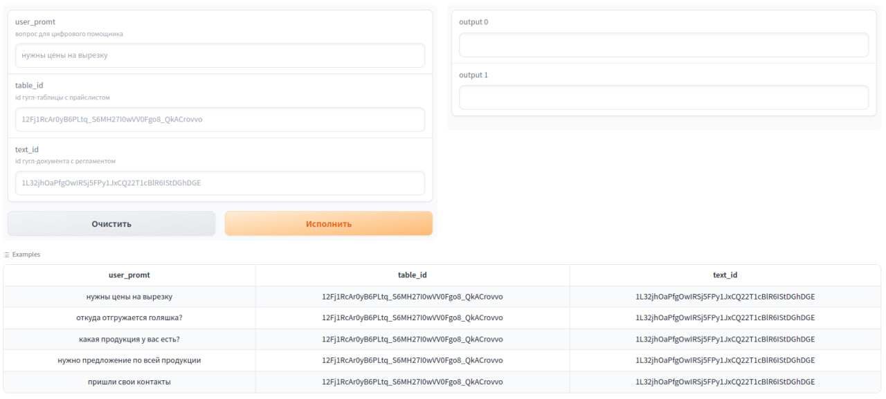
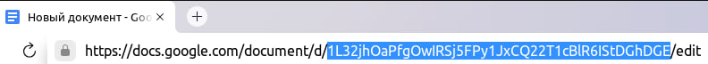

# Создание автоматических ответов пользователю с помощью ChatGPT, в соответствии с заданным регламентом и имеющимся прайс-листом

## [Способы взаимодействия](#способ-взаимодействия-1)
* [API](#api)
* [Демостраница](#демостраница)
* [Сurl запрос](#сurl-запрос)

# Способ взаимодействия
## API

Api доступно ссылке: https://ai.m16.tech/api/chat_helper

Авторизация в ai.m16.tech:

Логин: user

Пароль: {{API_PASSWORD}}

Принимает: 
```json
{
    "user_promt": "нужны цены на вырезку", #сообщение пользователя
    "table_id": "12Fj1RcAr0yB6PLtq_S6MH27I0wVV0Fgo8_QkACrovvo", #id гугл-таблицы с прайс-листом продукции
    "text_id": "1L32jhOaPfgOwIRSj5FPy1JxCQ22T1cBlR6IStDGhDGE" #id гугл-документом с регламентом помощника
}
```
Аргументы table_id и text_id не обязательные.

Возвращает: 
```json
{"reply": 
"Говяжья вырезка - 18 рублей за 1 кг, срок поставки 3 недели, халяльный продукт.
\nТелячья вырезка - 912 рублей за 1 кг, срок поставки 4 недели, не является халяльным продуктом.
\nЕсли вас заинтересовал какой-то конкретный вид, я могу дать более подробную информацию.", 
"charge": "2696 tokens, $0.002827"}
```

## Сurl запрос

```sh
curl -u "{{API_USER}}:{{API_PASSWORD}}" -d '{"user_promt": "нужны цены на вырезку", "table_id": "12Fj1RcAr0yB6PLtq_S6MH27I0wVV0Fgo8_QkACrovvo", "text_id": "1L32jhOaPfgOwIRSj5FPy1JxCQ22T1cBlR6IStDGhDGE"}' -H "Content-Type: application/json" -X POST https://ai.m16.tech/api/chat_helper
```
## Демостраница 
доступна по ссылке: (https://ai.m16.tech/gradio/chat_helper)



# Принцип работы
Приложение получает на вход сообщение пользователя и генерирует ответ на основании регламента и прайс-листа.

# Используемые данные
* id google документа с регламентом бота [1L32jhOaPfgOwIRSj5FPy1JxCQ22T1cBlR6IStDGhDGE](https://docs.google.com/document/d/1L32jhOaPfgOwIRSj5FPy1JxCQ22T1cBlR6IStDGhDGE)
* id google таблицы с прайс-листом [12Fj1RcAr0yB6PLtq_S6MH27I0wVV0Fgo8_QkACrovvo](https://docs.google.com/spreadsheets/d/12Fj1RcAr0yB6PLtq_S6MH27I0wVV0Fgo8_QkACrovvo)

id таблицы и документа можно скопировать из адресной строки браузера:



оба id находятся в файле `__init__.py`.

# Пример работы в телеграм-боте


