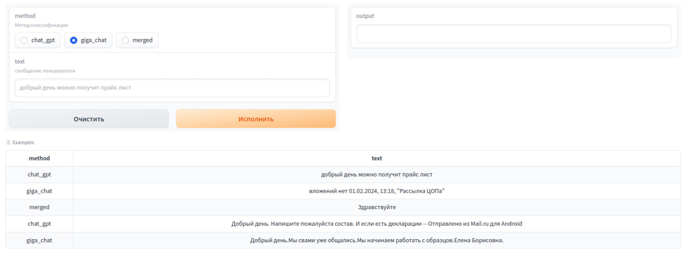

# Квалификация сообщений заданным набором ярлыков
Классификация сообщений доуступна тремя способами:
- Chat GPT
- Giga Chat
- объединение Chat GPT и Giga Chat

## [Способ взаимодействия](#способ-взаимодействия-1)
* [API](#api)
* [Демостраница](#демостраница)
* [Сurl запрос](#сurl-запрос)

# Способ взаимодействия
## API

Api доступно ссылке: https://ai.m16.tech/api/msg_classifier

Авторизация в ai.m16.tech:

Логин: user

Пароль: {{API_PASSWORD}}

Принимает: 
```json
{
    "method": "chat_gpt", "text": "добрый день можно получит прайс лист"
    }
```
```json
{
    "method": "giga_chat", "text": "добрый день можно получит прайс лист"
    }
```
```json
{
    "method": "merged", "text": "добрый день можно получит прайс лист"
    }
```

Возвращает: 
```json
{
    "msg_classes": ['запрос прайса']
    }
```

## Сurl запрос

```sh
curl -u "{{API_USER}}:{{API_PASSWORD}}" -d '{"method": "giga_chat", "text": "добрый день можно получит прайс лист"}' -H "Content-Type: application/json" -X POST https://ai.m16.tech/api/msg_classifier
```
Демостраница доступна по ссылке: (https://ai.m16.tech/gradio/msg_classifier)



# Принцип работы
Приложение получает на вход сообщение пользователя и присваивает ему ярлыки из заданного набора.

# Используемые данные
* словарь {'ярлык': 'описание'}
* список [ярлыки]