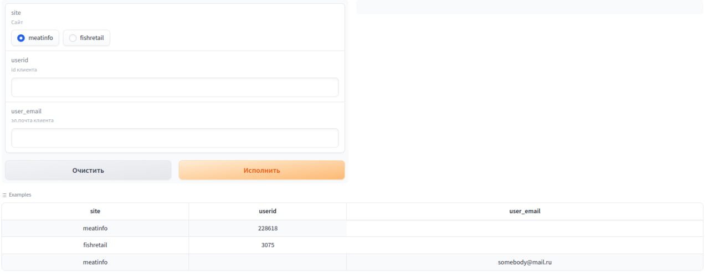

# Получение json с информацией о пользователе и о его действиях
## API
Api доступно ссылке: https://ai.m16.tech/api/user_profile_user_json

Авторизация в ai.m16.tech:

Логин: user

Пароль: {{API_PASSWORD}}

Принимает: 
```json
{
    "site": "meatinfo",
    "userid": 228618
    }
```
Возвращает: 
```json
{
    'json_key': json_data
}
```
## Сurl запрос

```sh
curl -u "{{API_USER}}:{{API_PASSWORD}}" -d '{"site": "meatinfo", "userid": 228618}' -H "Content-Type: application/json" -X POST https://ai.m16.tech/api/user_profile_user_json
```
# Получение json с информацией о компании и её сотрудниках
## API
Api доступно ссылке: https://ai.m16.tech/api/user_profile_company_json

Авторизация в ai.m16.tech:

Логин: user

Пароль: {{API_PASSWORD}}

Принимает: 
```json
{
    "site": "meatinfo",
    "company_id": 228618
    }
```
Возвращает: 
```json
{
    'json_key': json_data
}
```
## Сurl запрос

```sh
curl -u "{{API_USER}}:{{API_PASSWORD}}" -d '{"site": "meatinfo", "company_id": 163687}' -H "Content-Type: application/json" -X POST https://ai.m16.tech/api/user_profile_company_json
```


# Создание карточки c информацией о пользователе и о его действиях

## [Способ взаимодействия](#способ-взаимодействия-1)
* [API](#api)
* [Демостраница](#демостраница)
* [Сurl запрос](#сurl-запрос)

## API
Api доступно ссылке: https://ai.m16.tech/api/user_profile

Авторизация в ai.m16.tech:

Логин: user

Пароль: {{API_PASSWORD}}

Принимает: 
```json
{
    "site": "meatinfo",
    "userid": 228618
    }
```
или
```json
{
    "site": "meatinfo",
    "user_email": "somebody@mail.ru"
    }
```
Возвращает: 
```json
{
    'user_card': 'USERCARD_MARKDOWN'
}
```
[Пример карточки](example.md)

## Сurl запрос

```sh
curl -u "{{API_USER}}:{{API_PASSWORD}}" -d '{"site": "meatinfo", "userid": 228618}' -H "Content-Type: application/json" -X POST https://ai.m16.tech/api/user_profile
```
или
```sh
curl -u "{{API_USER}}:{{API_PASSWORD}}" -d '{"site": "meatinfo", "user_email": "somebody@mail.ru"}' -H "Content-Type: application/json" -X POST https://ai.m16.tech/api/user_profile
```
## Демостраница
Демостраница доступна по ссылке: (https://ai.m16.tech/gradio/user_profile)



## Принцип работы
Приложение получает на вход информацию о пользователе site и user_id и агрегирует информацию из датасетов.

## Используемые данные:
1. userStat
1. userProfile
1. tradeboard
1. user_profile(axe)
1. meatinfo_userprofile
1. fishretail_userprofile
1. catalogue_company
1. geobaza_region